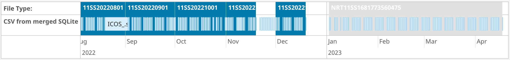
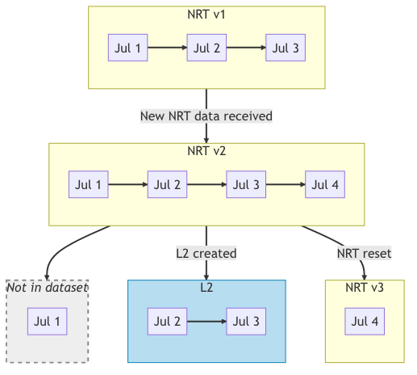

# Export to Carbon Portal

# Introduction
This document describes the export from QuinCe to the ICOS Carbon Portal (CP). The Carbon Portal has a full versioning system which accounts for both Near Real Time (L1) and QCed (L2) data, and how data 'transitions' from L1 to L2.

The QuinCe export script is responsible for uploading datasets to the Carbon Portal. In doing this, the script must determine what datasets are already in the CP, and whether the dataset being uploaded should be linked to any of them.

# QuinCe Data Progression
## Near Real Time data
For those instruments that transmit data in automatically in Near Real Time, QuinCe will retrieve the data at a suitable interval (usually daily). A special NRT dataset is created encompassing the time period from the end of the last 'real' dataset (hereafter referred to as L2) up to the latest NRT data point received. This is regenerated every time new data is received.

When the user creates an L2 dataset, the NRT dataset is automatically reset to start from the end of the new dataset.

## Data Export
QuinCe exports NRT datasets to the Carbon Portal whenever they are updated - either after new data is received and processed, or after the NRT dataset is reset following the creation of an L2 dataset. This means that the NRT dataset for an instrument will grow incrementally for a period, and then its start date will jump forward accordingly.

L2 datasets are exported to CP when they have been checked and approved by a member of OTC staff.

# Carbon Portal Data Progression
The Carbon Portal tracks multiple versions of both NRT (known as L1 in CP) and L2 datasets submitted to it. This becomes slightly complex considering QuinCe's process, since a given NRT dataset may end up being split between an L2 dataset and the continuing NRT.

The simplest relationship between dataset items in CP is `isNextVersionOf`, which specifies that a dataset being uploaded is the next version of an existing dataset (and that the existing dataset is deprecated). This can be used for the `NRT 2` dataset above, which will be `isNextVersionOf "NRT 1"`.

When an L2 dataset is uploaded in the example above, it will deprepate the existing NRT dataset, but not completely; the L2 dataset deprecates Jul 2 and Jul 3, while the 'reset' NRT dataset deprecates Jul 4. Therefore both the L2 and the 'reset' NRT together deprecate the original L1 dataset. In this case we need to add the `partialUpload` directive to both the L2 and 'reset' NRT uploads in addition to `isNextVersionOf`, to indicate that the original L1 dataset is deprecated by more than one newer dataset (one L1 and one L2 in this case). These relationships are shown in the diagram below.

")

Depending on how the L2 dataset is created in QuinCe, there may not need to be a `partialUpload` performed. For example, if the L2 dataset encompasses the full time period of the NRT dataset, the 'reset' NRT dataset will be empty. Therefore the L2 dataset will deprecate the complete L1 dataset when it is uploaded to CP, and the new NRT dataset will become a new entity as far as CP is concerned. The possible combinations of L2 dataset creation and the subsequent relationships created in CP are given below.

Consider an NRT dataset with data from Jul 1 to Jul 4:

This dataset is already uploaded to CP as an L1 dataset. At this stage it has not been deprecated by any new data.

The table below describes how the creation of various possible L2 datasets can be created from this NRT data, and the relationships that will be built when the resulting datasets are uploaded to CP.

| L2 start | L2 end | Reset NRT start | Reset NRT end | L2 relation to original NRT         | Reset NRT relation to original NRT  |
|:--------:|:------:|:---------------:|:-------------:|-------------------------------------|-------------------------------------|
| Jul 1    | Jul 2  | Jul 3           | Jul 4         | `partialDownload + isNextVersionOf` | `partialDownload + isNextVersionOf` |
| Jul 2    | Jul 3  | Jul 4           | Jul 4         | `partialDownload + isNextVersionOf` | `partialDownload + isNextVersionOf` |
| Jul 2    | Jul 4  | N/A             | N/A           | `isNextVersionOf`                   | N/A [^nonewnrt]                      |

[^nonewnrt]:The next NRT dataset will start on Jul 5 (when the new NRT data is received). However, this will have no relation to the previous NRT dataset because there will be no common data between them.

Note that the creation and upload of these datasets are asynchronous, and can happen in any order at any time. The export script will decide at upload time which dataset is being deprecated, and whether it expects a second deprecating dataset to be uploaded later, and will set the relationships accordingly.
