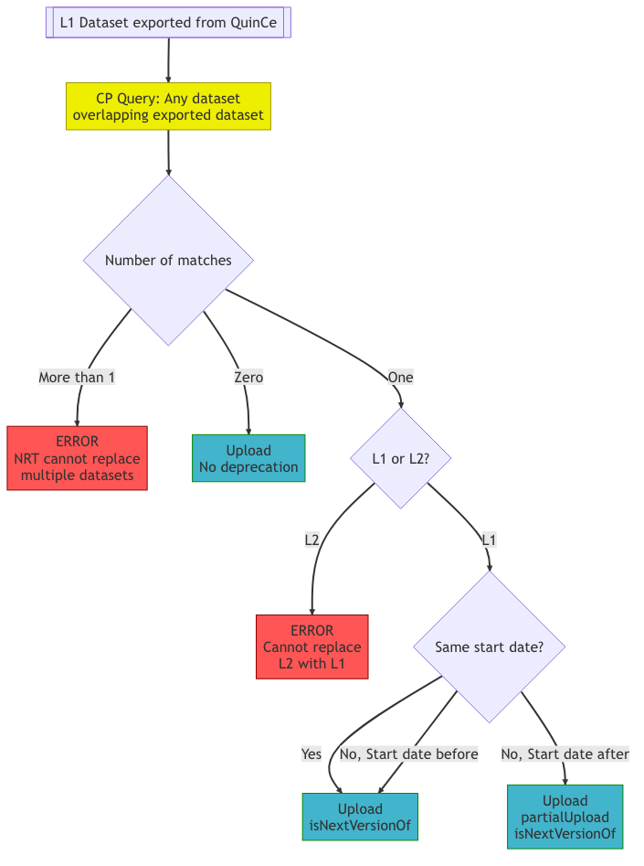
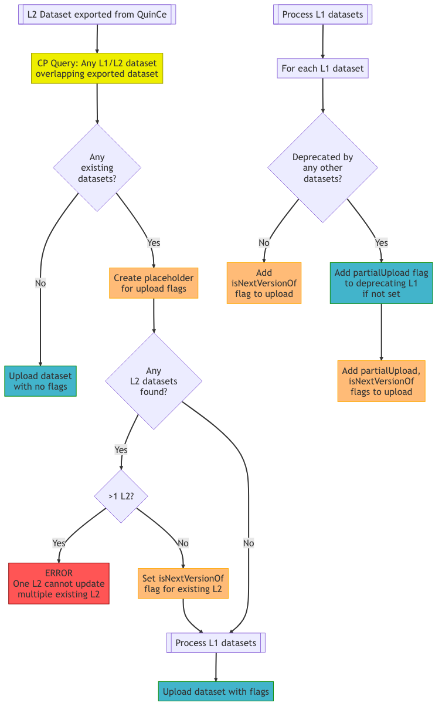

# Export to Carbon Portal

# Introduction
This document describes the export from QuinCe to the ICOS Carbon Portal (CP). The Carbon Portal has a full versioning system which accounts for both Near Real Time (L1) and QCed (L2) data, and how data 'transitions' from L1 to L2.

The QuinCe export script is responsible for uploading datasets to the Carbon Portal. In doing this, the script must determine what datasets are already in the CP, and whether the dataset being uploaded should be linked to any of them.

# QuinCe Data Progression
## Near Real Time data
For those instruments that transmit data in automatically in Near Real Time, QuinCe will retrieve the data at a suitable interval (usually daily). A special NRT dataset is created encompassing the time period from the end of the last 'real' dataset (hereafter referred to as L2) up to the latest NRT data point received. This is regenerated every time new data is received.


When the user creates an L2 dataset, the NRT dataset is automatically reset to start from the end of the new dataset.

## Data Export
QuinCe exports NRT datasets to the Carbon Portal whenever they are updated - either after new data is received and processed, or after the NRT dataset is reset following the creation of an L2 dataset. This means that the NRT dataset for an instrument will grow incrementally for a period, and then its start date will jump forward accordingly.


L2 datasets are exported to CP when they have been checked and approved by a member of OTC staff.

# Carbon Portal Data Progression
The Carbon Portal tracks multiple versions of both NRT (known as L1 in CP) and L2 datasets submitted to it. This becomes slightly complex considering QuinCe's process, since a given NRT dataset may end up being split between an L2 dataset and the continuing NRT.

The simplest relationship between dataset items in CP is `isNextVersionOf`, which specifies that a dataset being uploaded is the next version of an existing dataset (and that the existing dataset is deprecated). This can be used for the `NRT 2` dataset above, which will be `isNextVersionOf "NRT 1"`.

When an L2 dataset is uploaded in the example above, it will deprepate the existing NRT dataset, but not completely; the L2 dataset deprecates Jul 2 and Jul 3, while the 'reset' NRT dataset deprecates Jul 4. Therefore both the L2 and the 'reset' NRT together deprecate the original L1 dataset. In this case we need to add the `partialUpload` directive to both the L2 and 'reset' NRT uploads in addition to `isNextVersionOf`, to indicate that the original L1 dataset is deprecated by more than one newer dataset (one L1 and one L2 in this case). These relationships are shown in the diagram below.

")

Depending on how the L2 dataset is created in QuinCe, there may not need to be a `partialUpload` performed. For example, if the L2 dataset encompasses the full time period of the NRT dataset, the 'reset' NRT dataset will be empty. Therefore the L2 dataset will deprecate the complete L1 dataset when it is uploaded to CP, and the new NRT dataset will become a new entity as far as CP is concerned. The possible combinations of L2 dataset creation and the subsequent relationships created in CP are given below.

Consider an NRT dataset with data from Jul 1 to Jul 4:


This dataset is already uploaded to CP as an L1 dataset. At this stage it has not been deprecated by any new data.

The table below describes how the creation of various possible L2 datasets can be created from this NRT data, and the relationships that will be built when the resulting datasets are uploaded to CP.

| L2 start | L2 end | Reset NRT start | Reset NRT end | L2 relation to original NRT       | Relation of 'Reset' NRT to original NRT             |
|:--------:|:------:|:---------------:|:-------------:|-----------------------------------|-----------------------------------------------------|
| Jul 1    | Jul 2  | Jul 3           | Jul 4         | `partialUpload + isNextVersionOf` | `partialUpload + isNextVersionOf`                   |
| Jul 2    | Jul 3  | Jul 4           | Jul 4         | `partialUpload + isNextVersionOf` | `partialUpload + isNextVersionOf`                   |
| Jul 2    | Jul 4  | N/A             | N/A           | `isNextVersionOf`                 | New NRT created from Jul 5; not related to original |

Note that the creation and upload of these datasets are asynchronous, and can happen in any order at any time. The export script will decide at upload time which dataset is being deprecated, and whether it expects a second deprecating dataset to be uploaded later, and will set the relationships accordingly.

In the last row of the table, the data from Jul 1 will become orphaned, not belonging to any dataset (as seen in the earlier figure). It is possible that the user will create an L2 dataset containing the Jul 1 data, in which case the relation of both datasets must become `partialUpload + isNextVersionOf`. This will require editing the metadata for the Jul 2 - Jul 4 dataset.

# Export Logic
This section describes the decisions that the QuinCe export scripts must take when uploading data to the Carbon Portal. The logic is different between NRT/L1 and L2 datasets.

## L1

When a QuinCe NRT dataset is ready to be uploaded, we query CP to find any existing datasets that overlap it. If there is no such overlapping dataset, we can simply upload our NRT dataset as is, and no links to previous data need to be created. If there is more than one overlapping dataset found (either L1 or L2) then something has gone wrong in a previous export activity, so an error will be thrown and the issue will have to be fixed manually.

If there is exactly one existing dataset, and it is L2, then we must throw an error - an L2 dataset cannot be updated with an L1 dataset.

Finally there is the case of a single L1 dataset existing. Here, we check compare the start time of both the NRT and L1 datasets. If they are the same, then our NRT dataset is a simple update of the L1 dataset, so we upload it as a new version of the L1 by setting `isNextVerionOf`. Note that we don't check whether the NRT dataset is shorter than the L1 dataset, or if it starts before it: these are unexpected states, but not necessarily problematic if there is strange behaviour of the system that delivers NRT data to QuinCe.

If the new NRT start date is after the L1 start date, we assume that the user has created an L2 dataset in QuinCe, which will be updated and linked at a later date. Therefore we upload the NRT as the new version of the CP L1 dataset with both `partialUpload` and `isNextVersionOf` set.



## L2

When a QuinCe L2 dataset is ready to be uploaded, we query CP to find any existing datasets that overlap it. If there is no such overlapping dataset, we can simply upload our dataset as is, and no links to previous data need to be created. If there are overlapping datasets found, we need to flag our uploaded dataset as a new version of those found, and in some cases update other flags.

If our dataset overlaps more than one existing L2 dataset, then an error will be thrown - the data strategy for both QuinCe and ICOS means that this should not happen. If one L2 dataset is found, then the uploaded dataset will be marked as a new version of that using the `isNextVersion` flag as long as it has the same filename. Otherwise an error will be thrown.

For overlapping L1 datasets, the flags set depend on whether that dataset has already been deprecated by another dataset. If it has, then the dataset is deprecated by multiple datasets: the existing deprecations plus ours. We need to ensure that the `partialUpload` flag is set as well as the `isNextVersionOf` flag for both our upload and the existing datasets. If there are no existing deprecations for an L1 dataset, we simply set `isNextVersionof` for our upload.



# Example SPARQL Queries

Querying information about existing datasets in the Carbon Portal will be done through its SPARQL endpoint using the provided Python library.

## Identifying a station
Stations are identified in CP by a unique URL, which is unknown to QuinCe. However, QuinCe does know the name of the station. While we could look up the station by name every time, this will slow the subsequent queries. Therefore the first step of any activity will be to get the station's URL, which can then be plugged in to all subsequent queries.

```sparql
prefix xsd: <http://www.w3.org/2001/XMLSchema#>
prefix cpmeta: <http://meta.icos-cp.eu/ontologies/cpmeta/>
select ?uri
from <http://meta.icos-cp.eu/resources/icos/>
where {{
    ?uri a cpmeta:OS ; cpmeta:hasName "{STATION_NAME}"^^xsd:string .
}}
```

