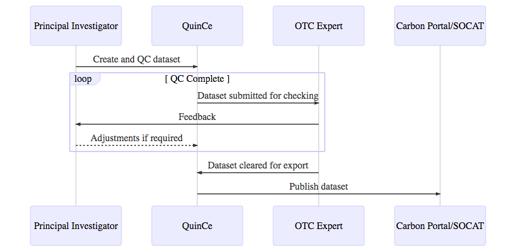
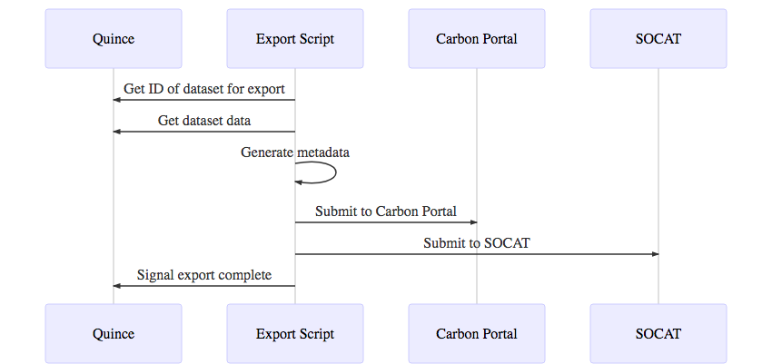
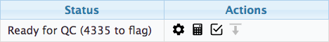

# Introduction

QuinCe exists to allow Principal Investigators (PIs) to upload, process and quality control datasets from their stations to make them ready for publication. In the workflow of the ICOS Ocean Thematic Centre (OTC), these datasets are checked by an expert in OTC who discusses any issues with the PI. Once the OTC expert is satisfied, the dataset is exported to the Carbon Portal and SOCAT for publication ([@Fig:dataset_flow]). (When data is received from non-ICOS stations the checking step will be skipped and the export destinations may be different, but the general idea will remain the same.)

{#fig:dataset_flow}

The process for submitting data to the Carbon Portal is relatively complex, requiring pre-registration of a submitted data set with metadata and the acquisition of a persistent identifier (PID) before the data itself is uploaded. This system is not designed to be a manual process. Additionally, QuinCe will not handle the complete metadata for the datasets it processes, since this functionality is being developed by collaborators in other projects and institutions. Similar automated submission protocols are being developed for SOCAT to reduce the manual effort involved, and these should be used by ICOS wherever possible.

Export of datasets from QuinCe and their publication to external data repositories will therefore be performed by an external script that communicates with QuinCe, and the publication systems at the Carbon Portal, SOCAT etc. This script will interrogate QuinCe to determine which data sets are ready for export, retrieve the necessary files, construct the required metdata documents and submit them to the appropriate locations ([@Fig:simple_script_flow]). The script will communicate the results of the export back to QuinCe so that the PI can track the progress and see when exporting is complete. At this point the dataset may be left alone, or archived in future versions on QuinCe[^archive].

[^archive]:Archiving a dataset will hide it from the default views in QuinCe to prevent cluttering when many datasets have been submitted. The exact mechanism for this is not yet determined, but all information regarding a dataset will always be fully retrievable.

{#fig:simple_script_flow}

# QuinCe

This section describes the features that will be added to QuinCe to support the export functionality.

## Dataset status

While a dataset is being processed, it is given various statuses to indicate progress through the automatic and manual processes. These help the user to understand what is happening to the dataset. Alongside the status is a section showing the actions that can be performed on that dataset ([@Fig:status_and_actions]). These change as the dataset is processed according to its current state.

{#fig:status_and_actions}

The possible satuses for a dataset, and the actions that will be available on a dataset in each of those statuses, are listed in [@Tbl:statuses].

-------------------------------------------------------------------------------
Status            Meaning                              Available actions
-------           ------------------------------------ ------------------------
Waiting           Waiting to be processed by           None
                  background jobs
  
Data extraction   Data being extracted from raw files  None
  
Data reduction    Data reduction under way             None
  
Automatic QC      Automatic QC under way               None
  
Ready for QC      Automatic processing complete;       Manual QC
                  Manual QC required
  
QC Complete       All QC activities complete           Manual QC,
                                                       Manual export,
                                                       Submit for checking
  
Expert            Waiting for expert check             Manual QC,
check                                                  Manual export,
                                                       Expert check
  
Ready for         Dataset ready for automated export   Manual QC,
export                                                 Manual export

Exporting         Automatic export and publishing      None
                  under way
  
Exported          Dataset has been exported            Manual QC,
                                                       Manual export,
                                                       Archive
  
ERROR             Error encountered during             None[^errorstatus]
                  any automatic processing
-------------------------------------------------------------------------------
Table: Possible status values for datasets {#tbl:statuses}

[^errorstatus]:If any automatic processing jobs fail, the dataset's status will be set to 'ERROR'. The cause and remedial action will need to be determined by the QuinCe support team, who will be notified of the problem automatically.

The station PI and OTC expert will be able to perform various actions on a dataset at different times, depending on its current status. [@Tbl:actions] describes the possible actions.

-------------------------------------------------------------------------------
Action            Description
---------         -------------------------------------------------------------
Manual QC         The user can examine the dataset and manually set QC flags
  
Manual export     The user can export the dataset for examination offline and
                  to allow them to submit datasets to repositories that are not
                  supported by the automated export script. The PI will be
                  responsible for ensuring that the dataset is in a suitable
                  state for publication.
  
Submit for        (ICOS stations) Once manual QC is complete and all required
checking          flags have been assigned, the PI must explicitly trigger an
                  action to submit the dataset to the OTC expert for checking.
  
Automatic export  (Non-ICOS stations) Since the expert check is not required,
                  the user will be given a separate action to signal that the
                  dataset is ready to be published to data repositories through
                  the automatic channels.

Expert check      This action will only be available to OTC experts. When a
                  dataset is submitted to the expert, they will be able to
                  approve or reject the dataset. If the dataset is approved it
                  will be changed to the 'Ready for export' state; otherwise
                  it will be returned to the 'Ready for QC' state and returned
                  to the PI.

Archive           Hides the dataset from the main QuinCe interface.
-------------------------------------------------------------------------------
Table: Actions that can be performed on datasets {#tbl:actions}
